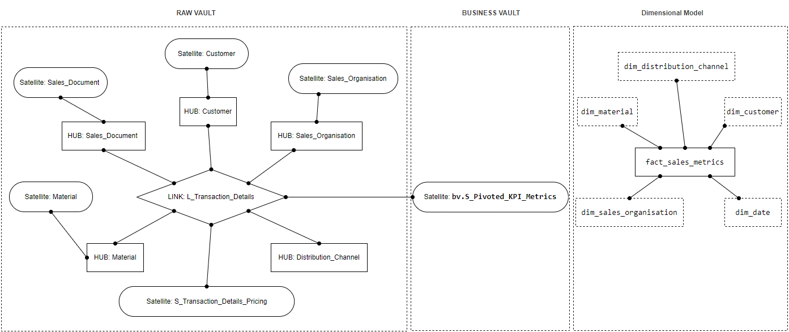

# Data Model Documentation

This document presents the **Raw Vault** and **Business Vault** design for managing data using **Data Vault 2.0 methodology**. It includes:

- Model structure with rationale for Hubs, Links, and Satellites
- SQL scripts for schema creation
- A transformation to a **Dimensional Model** for reporting
  
---

## Table of Contents

- [Data Model Documentation](#data-model-documentation)
  - [Table of Contents](#table-of-contents)
  - [Source Query Structure](#source-query-structure)
  - [Query Table](#query-table)
  - [Flow Diagram](#flow-diagram)
    - [Breakdown:](#breakdown)
  - [Implementation and Decision Rationale](#implementation-and-decision-rationale)
  - [SQL Statements (RAW VAULT)](#sql-statements-raw-vault)
    - [HUBS](#hubs)
      - [H\_Customer](#h_customer)
      - [H\_Sales\_Document](#h_sales_document)
      - [H\_Material](#h_material)
      - [H\_Sales\_Organisation](#h_sales_organisation)
      - [H\_Distribution\_Channel](#h_distribution_channel)
    - [SATELLITES](#satellites)
      - [S\_Customer](#s_customer)
      - [S\_Sales\_Document](#s_sales_document)
      - [S\_Material](#s_material)
      - [S\_Sales\_Organisation](#s_sales_organisation)
      - [S\_Transaction\_Details\_Pricing](#s_transaction_details_pricing)
    - [LINK](#link)
      - [L\_Transaction\_Details](#l_transaction_details)
  - [SQL Statements (BUSINESS VAULT)](#sql-statements-business-vault)
      - [bv.S\_Pivoted\_KPI\_Metrics](#bvs_pivoted_kpi_metrics)
  - [SQL Statements (Dimensional Model)](#sql-statements-dimensional-model)
      - [dim\_date](#dim_date)
      - [dim\_customer](#dim_customer)
      - [dim\_material](#dim_material)
      - [dim\_sales\_organisation](#dim_sales_organisation)
      - [dim\_distribution\_channel](#dim_distribution_channel)
      - [fact\_sales\_metrics](#fact_sales_metrics)

## Source Query Structure

This is the aggregated query that serves as the input for our vault model.

```sql
WITH cte AS (
  SELECT
    c.vtweg AS distribution_channel,
    c.vkorg AS sales_organization,
    c.budat AS billing_doc_date,
    c.kaufn AS sales_document,
    c.vkgrp AS sales_group,
    c.artnr AS material_id,
    m.maktx AS material_text,
    k.kunnr AS customer_no,
    k.nam1 AS customer_name,
    SUM(VVR03) AS Quantity,
    SUM(...) AS TGS,
    SUM(...) AS TNS
  FROM hcdap_prod.bronze_dds.mart_pricingtool_vw_ce15611_d0 c
  LEFT JOIN hcdap_prod.bronze_sapptt.makt m ON ARTNR = MATNR AND SPRAS = 'E'
  LEFT JOIN hcdap_prod.bronze_sapptt.kna1 k ON c.kndnr = k.kunnr
  WHERE c.PALEDGER = '01'
    AND c.vkorg = '0022'
    AND c.VTWEG IN ('A0', 'A4')
    AND c.BUDAT = '20241001'
  GROUP BY ALL
)
SELECT *
FROM cte
UNPIVOT INCLUDE NULLS (
  payload FOR KPI_values IN (Quantity, TGS, TNS)
);
```

## Query Table

This table represents the output from the query that feeds into the Raw Vault.

| Column Name            | Description                                  |
|------------------------|----------------------------------------------|
| distribution channel | Sales distribution channel (e.g., A0)        |
| sales_organization   | Sales organization ID (e.g., 22)             |
| billing_doc_date     | Date of the billing document                 |
| sales_document       | Unique identifier for the sales document     |
| sales_group          | Sales group within the organization          |
| material_id          | Material identifier                          |
| material_text        | Description or name of the material          |
| customer_no          | Customer identifier                          |
| customer_name        | Customer name                                |
| KPI_values           | KPI type (e.g., Quantity, TGS, TNS)          |
| payload              | Numeric or textual value associated with KPI |

---

## Flow Diagram

The following diagram illustrates the **end-to-end data flow** across the different layers of the Data Vault 2.0 architecture:

- **Raw Vault**: Captures raw, auditable data using Hubs, Links, and Satellites.
- **Business Vault**: Applies business logic, pivoting, and enrichment on top of the raw model.
- **Dimensional Model**: Provides a reporting-friendly star schema for end-user analytics and dashboards.

### Breakdown:

- **Hubs** (HUB: Customer, HUB: Material, etc.) represent unique business keys.
- **Satellites** (e.g., Satellite: Sales_Document) store descriptive and historical attributes.
- **Link** (LINK: L_Transaction_Details) connects related hubs, forming the core transactional record.
- **Business Vault Satellite** (bv.S_Pivoted_KPI_Metrics) performs metric aggregation and pivoting.
- **Fact and Dimension Tables** (e.g., fact_sales_metrics, dim_customer) support performant reporting and visualization.

This structured flow ensures **data integrity, scalability, and traceability** from source ingestion to final analytics.



---

## Implementation and Decision Rationale

 1. HUB: Distribution_Channel is converted to a HUB instead of a satellite, even though it only has id and no associated descriptive attributes because it is a distinct and reusable business concept that can exist independently. Distribution_Channel can be shared across customer, material or organisation with in transactions or when reporting. 
 2. Transaction Detail Link: We have created single link which joins all the entities together instead of creating separate links joining two entities together as it depicts the exact behaviour of a transaction between different entities present.
 3. S_Transaction Detail Pricing: This is connected with Transaction Detail Link as it hold metrics that are not connected with one entity. The metrics are formed by the combination of all the entities present within the system.
 4. Business Vault: We are using the same Hubs and related satellites within the business vault as the data present is very limited and no new computed attributes or curated hubs were created. Hence, business vault is left with only one Satellite which pivots the KPI_Values to show quantity, TGS and TNS values plus on the basis of these calculates some additional metrics. Furthermore, no point in time table was created inside the business vault as no multiple satellites were used by the same hub.
 5. Dimensional Model: Dimensional model was created using the business vault satellite and dimensions from the hubs plus satellites from the raw vault. They all have effective date, is_current and load_dts for slowly changing dimensions capture. Simple aggregations or metrics are left for to be handled within BI tool such as calculating quantity, TNS, TGS etc. per customer, organisation, distribution channel or top 5 materials used. *DIM_DATE* table is created to enrich fact tables with temporal attributes. It provides a detailed calendar structure that supports time-based filtering, grouping, and reporting.

## SQL Statements (RAW VAULT)

The *Raw Vault* is the foundational layer of the Data Vault architecture. It captures raw, auditable, and historical data from source systems with no transformations or business rules applied. This layer includes Hubs (business keys), Links (relationships), and Satellites (descriptive context) — designed for flexibility, scalability, and auditability.

### HUBS

Each hub represents a **unique business key**. We use them to ensure traceability and historical accuracy.

| Hub Table              | Business Key        | Description |
|------------------------|---------------------|-------------|
| H_Customer           | customer_no       | Unique customers |
| H_Sales_Document     | sales_document    | Unique sales records |
| H_Material           | material_id       | Distinct products/materials |
| H_Sales_Organisation | sales_organization| Sales organizational unit |
| H_Distribution_Channel | distribution_channel | Sales distribution path |

#### H_Customer

The *H_Customer* table is a Hub that stores the unique business key for each customer in the sales data. This Hub ensures traceability, allows for historical tracking of customer-related events, and forms the base for any descriptive data about customers stored in associated satellites (e.g., names, addresses, etc.).

```sql
CREATE TABLE H_Customer (
    Customer_HKey VARCHAR(64) PRIMARY KEY, -- A hashed key based on customer_no
    Load_DTS DATETIME NOT NULL, -- Record load timestamp
    REC_SRC VARCHAR(50), -- Originating source system
    CUSTOMER_NO VARCHAR(50) -- Natural key representing the customer
);
```

#### H_Sales_Document

The *H_Sales_Document* table is a Hub that captures the unique sales transaction identifiers (sales_document). This is a central entity in any sales process and serves as the anchor for transactional relationships in the vault. All event-level and descriptive information about a sales transaction is tracked through this hub and its related satellites and links.

```sql
CREATE TABLE H_Sales_Document (
    Sales_Document_HKey VARCHAR(64) PRIMARY KEY, -- Hashed key based on sales_document
    Load_DTS DATETIME NOT NULL, -- Record load timestamp
    REC_SRC VARCHAR(50), -- Originating source system
    SALES_DOCUMENT_NO VARCHAR(50)  -- Natural key representing the sales document
);
```

#### H_Material

The *H_Material* table serves as a Hub for uniquely identifying each material in the dataset. In sales analysis, the material ID is essential for product-level reporting, performance tracking, and inventory evaluations. This hub links to satellite tables storing material descriptions and other attributes.

```sql
CREATE TABLE H_Material (
    Material_HKey VARCHAR(64) PRIMARY KEY, -- Hashed key derived from material_id
    Load_DTS DATETIME NOT NULL, -- Record load timestamp
    REC_SRC VARCHAR(50), -- Originating source system
    MATERIAL_NO VARCHAR(50) -- Natural key representing the material
);
```

#### H_Sales_Organisation

The *H_Sales_Organisation* Hub captures unique sales organizations, such as departments, branches, or legal entities managing the sales process. This hub supports enterprise-wide reporting and roll-ups by business unit.

```sql
CREATE TABLE H_Sales_Organisation (
    Sales_Organisation_HKey VARCHAR(64) PRIMARY KEY, -- Hashed key derived from organisation_no
    Load_DTS DATETIME NOT NULL, -- Record load timestamp
    REC_SRC VARCHAR(50), -- Originating source system
    ORGANISATION_NO VARCHAR(50) -- Natural key representing the organisation
);
```

#### H_Distribution_Channel

The *H_Distribution_Channel* table acts as a Hub for different sales distribution methods (e.g., online, retail, wholesale). This enables channel-based reporting and performance analysis. It allows you to track how material are sold and to whom.

```sql
CREATE TABLE H_Distribution_Channel (
    Distribution_Channel_HKey VARCHAR(64) PRIMARY KEY, -- Hashed key derived from distribution_channel_id
    Load_DTS DATETIME NOT NULL, -- Record load timestamp
    REC_SRC VARCHAR(50), -- Originating source system
    DISTRIBUTION_CHANNEL_ID VARCHAR(50) -- Natural key representing the distribution channel
);
```

### SATELLITES

Satellites store **descriptive attributes** and **contextual information** tied to business keys in the hubs. They also track changes over time using load timestamps and hash differences.

| Satellite Table                 | Attached To             | Description |
|--------------------------------|--------------------------|-------------|
| S_Customer                  | H_Customer            | Stores customer name and tracks changes |
| S_Sales_Document            | H_Sales_Document      | Holds billing document date |
| S_Material                  | H_Material            | Contains material description |
| S_Sales_Organisation        | H_Sales_Organisation   | Tracks sales group info |
| S_Transaction_Details_Pricing | `L_Transaction_Details | Stores KPI metrics (Quantity, TGS, TNS) related to transactions |

---

#### S_Customer

The *S_Customer* table is a Satellite connected to the *H_Customer* hub. It stores descriptive attributes of the customer entity, such as the customer's name.

```sql
CREATE TABLE S_Customer (
    Customer_HKey VARCHAR(64), -- Foreign key to H_Customer
    Load_DTS DATETIME, -- Load timestamp for change tracking
    REC_SRC VARCHAR(50), -- Source of the data
    HashDiff VARCHAR(64), -- Hash of the descriptive columns for change detection
    Name VARCHAR(255), -- Customer name
    PRIMARY KEY (Customer_HKey, Load_DTS),
    FOREIGN KEY (Customer_HKey) REFERENCES H_Customer(Customer_HKey)
);
```

#### S_Sales_Document

The *S_Sales_Document* satellite provides transactional context to the *H_Sales_Document* hub. It stores attributes like the billing document date.

```sql
CREATE TABLE S_Sales_Document (
    Sales_Document_HKey VARCHAR(64), -- Foreign key to H_Sales_Document
    Load_DTS DATETIME, -- Load timestamp for change tracking
    HashDiff VARCHAR(64), -- Hash of the descriptive columns for change detection
    REC_SRC VARCHAR(50), -- Source of the data
    BILLING_DOC_DATE DATE, -- Date of billing
    PRIMARY KEY (Sales_Document_HKey, Load_DTS),
    FOREIGN KEY (Sales_Document_HKey) REFERENCES H_Sales_Document(Sales_Document_HKey)
);
```

#### S_Material

The *S_Material* satellite is linked to the *H_Material* hub. It holds material metadata, such as the material text/description.

```sql
CREATE TABLE S_Material (
    Material_HKey VARCHAR(64), -- Foreign key to H_Material
    Load_DTS DATETIME, -- Load timestamp for change tracking
    REC_SRC VARCHAR(50), -- Source of the data
    HashDiff VARCHAR(64), -- Hash of the descriptive columns for change detection
    MATERIAL_TXT VARCHAR(255), -- material description
    PRIMARY KEY (Material_HKey, Load_DTS),
    FOREIGN KEY (Material_HKey) REFERENCES H_Material(Material_HKey)
);
```

#### S_Sales_Organisation

The *S_Sales_Organisation* satellite connects to the *H_Sales_Organisation* hub and holds additional organizational structure information, such as the sales group. It enables granular organizational analysis over time.

```sql
CREATE TABLE S_Sales_Organisation (
    Sales_Organisation_HKey VARCHAR(64), -- Foreign key to H_Sales_Organisation
    Load_DTS DATETIME, -- Load timestamp for change tracking
    REC_SRC VARCHAR(50), -- Source of the data
    HashDiff VARCHAR(64), -- Hash of the descriptive columns for change detection
    SALES_GROUP VARCHAR(255), -- Sales team or unit name
    PRIMARY KEY (Organisation_HKey, Load_DTS),
    FOREIGN KEY (Organisation_HKey) REFERENCES H_Sales_Organisation(Sales_Organisation_HKey)
);
```

#### S_Transaction_Details_Pricing

The *S_Transaction_Details_Pricing* satellite links to the *L_Transaction_Details* link and stores KPI-related facts. This satellite supports multi-grain fact storage and allows us to handle metric pivoting and analysis in the Business Vault.

```sql
CREATE TABLE S_Transaction_Details_Pricing (
    Transaction_Details_HKey VARCHAR(64), -- Foreign key to
    Load_DTS DATETIME, -- Load timestamp for change tracking
    HashDiff VARCHAR(64), -- Hash of the descriptive columns for change detection
    REC_SRC VARCHAR(50), -- Source of the data
    KPI_VALUES VARCHAR(255), -- Metric type (Quantity, TNS, TGS)
    PAYLOAD TEXT,  -- Value of the metric
    PRIMARY KEY (Transaction_Details_HKey, Load_DTS),
    FOREIGN KEY (Transaction_Details_HKey) REFERENCES L_Transaction_Details(Transaction_Details_HKey)
);
```

### LINK

Links model the **associative relationships** between business keys (Hubs) and form the backbone of transactional events. They ensure **integrity across entities** and are crucial for reconstructing business processes.

| Link Table             | Connected Hubs                                                                 | Description |
|------------------------|----------------------------------------------------------------------------------|-------------|
| L_Transaction_Details | H_Customer, H_Sales_Document, H_Material, H_Sales_Organisation, H_Distribution_Channel | Connects all relevant entities involved in a single sales transaction |

---

#### L_Transaction_Details

The *L_Transaction_Details* table is a Link that captures the many-to-many relationship between the core business entities involved in a sales transaction — including customer, sales document, sales organization, distribution channel, and material.

In Data Vault, links represent business transactions or associations and serve as the integration point across different Hubs. This table enables detailed analysis of each transaction by connecting relevant keys and preserving referential integrity across the Raw Vault.

```sql
CREATE TABLE L_Transaction_Details (
    Transaction_Details_HKey VARCHAR(64) PRIMARY KEY, -- Unique hash key across all participating hubs
    Sales_Document_HKey VARCHAR(64), -- FK to H_Sales_Document
    Sales_Organisation_HKey VARCHAR(64), -- FK to H_Sales_Organisation
    Customer_HKey VARCHAR(64), -- FK to H_Customer
    Distribution_Channel_HKey VARCHAR(64), -- FK to H_Distribution_Channel
    Material_HKey VARCHAR(64), -- FK to H_Material
    Load_DTS DATETIME NOT NULL, -- Load timestamp for the link
    REC_SRC VARCHAR(50), -- Source system for lineage tracking
    FOREIGN KEY (Sales_Document_HKey) REFERENCES H_Sales_Document(Sales_Document_HKey),
    FOREIGN KEY (Sales_Organisation_HKey) REFERENCES H_Sales_Organisation(Sales_Organisation_HKey),
    FOREIGN KEY (Customer_HKey) REFERENCES H_Customer(Customer_HKey),
    FOREIGN KEY (Distribution_Channel_HKey) REFERENCES H_Distribution_Channel(Distribution_Channel_HKey),
    FOREIGN KEY (Material_HKey) REFERENCES H_Material(Material_HKey)
);
```

## SQL Statements (BUSINESS VAULT)

The *Business Vault* adds business logic, aggregations, and denormalized views on top of the Raw Vault. It’s where data becomes ready for analytical consumption while retaining auditability.

#### bv.S_Pivoted_KPI_Metrics

This table is a Business Vault satellite that pivots the raw KPI values (Quantity, TGS, TNS)  and also derives additional performance indicators such as gross_profit, profit_margin_pct, avg_selling_price, and avg_net_price into columns for easier aggregation and analysis. It groups metrics by customer, material, sales organization, and distribution channel.

```sql
CREATE TABLE IF NOT EXISTS bv.S_Pivoted_KPI_Metrics AS
SELECT
  l.Customer_HKey,
  l.Material_HKey,
  l.Sales_Organisation_HKey,
  l.Distribution_Channel_HKey,
    -- Pivoted and Aggregated base metrics
  SUM(CASE WHEN p.KPI_VALUES = 'Quantity' THEN CAST(p.PAYLOAD AS NUMERIC) ELSE 0 END) AS quantity,
  SUM(CASE WHEN p.KPI_VALUES = 'TNS' THEN CAST(p.PAYLOAD AS NUMERIC) ELSE 0 END) AS tns,
  SUM(CASE WHEN p.KPI_VALUES = 'TGS' THEN CAST(p.PAYLOAD AS NUMERIC) ELSE 0 END) AS tgs,
    -- Derived KPIs
  SUM(CASE WHEN p.KPI_VALUES = 'TGS' THEN CAST(p.PAYLOAD AS NUMERIC) ELSE 0 END) - 
  SUM(CASE WHEN p.KPI_VALUES = 'TNS' THEN CAST(p.PAYLOAD AS NUMERIC) ELSE 0 END) AS gross_profit,
  CASE 
    WHEN SUM(CASE WHEN p.KPI_VALUES = 'TGS' THEN CAST(p.PAYLOAD AS NUMERIC) ELSE 0 END) = 0 THEN 0
    ELSE (
      (SUM(CASE WHEN p.KPI_VALUES = 'TGS' THEN CAST(p.PAYLOAD AS NUMERIC) ELSE 0 END) - 
       SUM(CASE WHEN p.KPI_VALUES = 'TNS' THEN CAST(p.PAYLOAD AS NUMERIC) ELSE 0 END)) * 100.0 /
       SUM(CASE WHEN p.KPI_VALUES = 'TGS' THEN CAST(p.PAYLOAD AS NUMERIC) ELSE 0 END)
    )
  END AS profit_margin_pct,
  CASE 
    WHEN SUM(CASE WHEN p.KPI_VALUES = 'Quantity' THEN CAST(p.PAYLOAD AS NUMERIC) ELSE 0 END) = 0 THEN 0
    ELSE SUM(CASE WHEN p.KPI_VALUES = 'TGS' THEN CAST(p.PAYLOAD AS NUMERIC) ELSE 0 END) /
         SUM(CASE WHEN p.KPI_VALUES = 'Quantity' THEN CAST(p.PAYLOAD AS NUMERIC) ELSE 0 END)
  END AS avg_selling_price,
  CASE 
    WHEN SUM(CASE WHEN p.KPI_VALUES = 'Quantity' THEN CAST(p.PAYLOAD AS NUMERIC) ELSE 0 END) = 0 THEN 0
    ELSE SUM(CASE WHEN p.KPI_VALUES = 'TNS' THEN CAST(p.PAYLOAD AS NUMERIC) ELSE 0 END) /
         SUM(CASE WHEN p.KPI_VALUES = 'Quantity' THEN CAST(p.PAYLOAD AS NUMERIC) ELSE 0 END)
  END AS avg_net_price,
  CURRENT_TIMESTAMP AS Load_DTS,
  'BV_KPI_PIVOT' AS REC_SRC
FROM L_Transaction_Details l
JOIN S_Transaction_Details_Pricing p ON l.Transaction_Details_HKey = p.Transaction_Details_HKey
GROUP BY
  l.Customer_HKey,
  l.Material_HKey,
  l.Sales_Organisation_HKey,
  l.Distribution_Channel_HKey;
```

## SQL Statements (Dimensional Model)

The *Dimensional Model* is designed for optimized querying and reporting. It transforms the detailed, historical structure of the Data Vault into a denormalized star schema, featuring fact and dimension tables.

#### dim_date

The *dim_date* table is a time dimension used to enrich fact tables with temporal attributes. It provides a detailed calendar structure that supports time-based filtering, grouping, and reporting.

```sql
CREATE TABLE IF NOT EXISTS dim_date (
    Date_ID DATE PRIMARY KEY, 
    Full_Date_Desc VARCHAR(50), 
    Day_Number INT,
    Day_Name VARCHAR(15), 
    Weekday_Flag BOOLEAN, 
    Week_Number INT, 
    Month_Number INT, 
    Month_Name VARCHAR(15),
    Quarter_Number INT,
    Year_Number INT,                         
);
```

#### dim_customer

The *dim_customer* table is a slowly changing dimension (SCD Type 2) that stores customer names and history. It allows tracking of customer attribute changes over time using effective/expiration dates and an Is_Current flag.

```sql
CREATE TABLE IF NOT EXISTS dim_customer AS
SELECT
    s.Customer_HKey,
    s.Name,
    s.HashDiff,
    s.Load_DTS AS Effective_Date,
    LEAD(s.Load_DTS) OVER (PARTITION BY s.Customer_HKey ORDER BY s.Load_DTS) AS Expiration_Date,
    CASE
        WHEN LEAD(s.Load_DTS) OVER (PARTITION BY s.Customer_HKey ORDER BY s.Load_DTS) IS NULL THEN 1
        ELSE 0
    END AS Is_Current,
    s.Load_DTS,
    s.REC_SRC
FROM S_Customer s;
```

#### dim_material

The *dim_material* table is a dimension table capturing material descriptions. Like the customer dimension, it implements SCD Type 2 logic.

```sql
CREATE TABLE IF NOT EXISTS dim_material AS
SELECT
    s.Material_HKey,
    s.MATERIAL_TXT,
    s.HashDiff,
    s.Load_DTS AS Effective_Date,
    LEAD(s.Load_DTS) OVER (PARTITION BY s.Material_HKey ORDER BY s.Load_DTS) AS Expiration_Date,
    CASE
        WHEN LEAD(s.Load_DTS) OVER (PARTITION BY s.Material_HKey ORDER BY s.Load_DTS) IS NULL THEN 1
        ELSE 0
    END AS Is_Current,
    s.Load_DTS,
    s.REC_SRC
FROM S_Material s;
```

#### dim_sales_organisation

The *dim_sales_organisation* holds information about the sales organization structure, such as the sales group. It is modeled as a slowly changing dimension to reflect organizational changes over time.

```sql
CREATE TABLE IF NOT EXISTS dim_sales_organisation AS
SELECT
    s.Sales_Organisation_HKey,
    s.SALES_GROUP,
    s.HashDiff,
    s.Load_DTS AS Effective_Date,
    LEAD(s.Load_DTS) OVER (PARTITION BY s.Sales_Organisation_HKey ORDER BY s.Load_DTS) AS Expiration_Date,
    CASE
        WHEN LEAD(s.Load_DTS) OVER (PARTITION BY s.Sales_Organisation_HKey ORDER BY s.Load_DTS) IS NULL THEN 1
        ELSE 0
    END AS Is_Current,
    s.Load_DTS,
    s.REC_SRC
FROM S_Sales_Organisation s;
```

#### dim_distribution_channel

The *dim_distribution_channel* is a static dimension, as distribution channels rarely change. It maps the raw distribution channel identifiers into a consistent reference for reporting and slicing metrics.

```sql
CREATE TABLE IF NOT EXISTS dim_distribution_channel AS
SELECT
    dc.Distribution_Channel_HKey,
    dc.DISTRIBUTION_CHANNEL_ID,
    CURRENT_TIMESTAMP AS Effective_Date,
    NULL AS Expiration_Date,
    1 AS Is_Current,
    CURRENT_TIMESTAMP AS Load_DTS,
    'STATIC_HUB_LOAD' AS REC_SRC,
    NULL AS HashDiff
FROM H_Distribution_Channel dc;
```

#### fact_sales_metrics

The *fact_sales_metrics* table is the central fact table in the star schema. It holds aggregated KPI values such as quantity, TNS (Total Net Sales), and TGS (Total Gross Sales), and foreign keys to all related dimensions.

```sql
CREATE TABLE IF NOT EXISTS fact_sales_metrics AS
SELECT
    kpi.Customer_HKey,
    kpi.Material_HKey,
    kpi.Sales_Organisation_HKey,
    kpi.Distribution_Channel_HKey,
    kpi.quantity,
    kpi.tns,
    kpi.tgs,
    kpi.gross_profit,
    kpi.profit_margin_pct,
    kpi.avg_selling_price,
    kpi.avg_net_price,
    kpi.Load_DTS AS Metrics_Effective_From,
    'FACT_SALES_METRICS_BUILD' AS REC_SRC
FROM bv.S_Pivoted_KPI_Metrics kpi;
```
