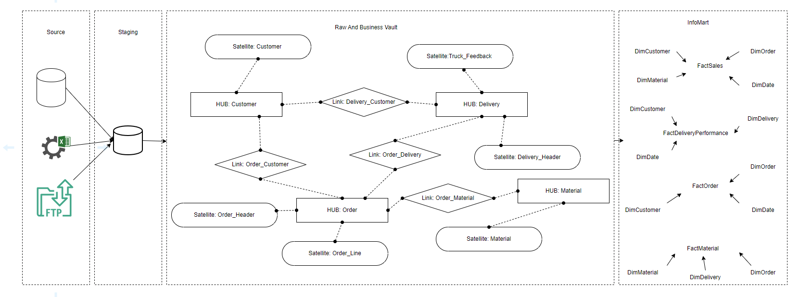

# Data Model Documentation

This documentation describes the design and implementation of a data warehouse that integrates data from order management and freight forwarding systems. The objective is to create a robust data model that supports analytical use cases such as sales analysis, customer behavior, and logistics performance.

---

## Table of Contents

- [Data Model Documentation](#data-model-documentation)
  - [Table of Contents](#table-of-contents)
  - [Identification of Challanges](#identification-of-challanges)
  - [Flow Diagram](#flow-diagram)
      - [Source System](#source-system)
      - [Staging Area](#staging-area)
      - [Raw and Business Vault](#raw-and-business-vault)
      - [InfoMart](#infomart)
  - [Open Questions](#open-questions)

## Identification of Challanges

The following challenges must be addressed to ensure data integrity, consistency, and performance across the data warehouse solution

1. **Matching Data Between System (Internal vs FTP)**

    The internal delivery system and the freight forwarder's truck feedback table may use different identifiers or formats. A mapping or transformation logic must be developed to synchronize delivery references. 

2. **Data Quality**

    Data may contain duplicate records, inconsistent keys, or malformed entries. Implement quality checks during ingestion (e.g., null checks, uniqueness constraints) and deduplication rules to ensure only clean records proceed to the vault layer.

3. **Aligning Time Zones and Formats**

    Different systems may use varied timestamp formats and time zones. Normalize all timestamps in the ETL layer to a standard time zone (e.g., UTC) and use the DimDate for accurate time-based analysis.

4. **Use of PIT (Point-In-Time) Tables**

    Orders and deliveries have multiple satellites (headers, lines, feedback, etc.) that may not change at the same time. Build PIT tables for Order and Delivery to allow consistent and performant access to the latest or relevant historical states.

5. **Managing Slowly Changing Dimensions (SCD)**

    Decide on an SCD approach:

        - Type 1 (overwrite) for non-critical history

        - Type 2 (versioned records) for full historization

6. **Late-Arriving Data and Out-of-Sequence Events**

    External sources such as FTP File, may arrive late or be reprocessed. Implement effective-dated loading and hash comparison logic to support late-arriving records without overwriting newer data unintentionally.

7. **Data Volume & Performance Scalability**

    As volume grows, maintaining performance during loading, transformation, and querying can be difficult. Plan for partitioning strategies, columnar storage, and workload management.

8. **Handling of Semi-Structured Data**

    Excel files and FTP sources may contain semi-structured fields or inconsistent data due to manual input errors. Transforming this information into clean, atomic, and model-ready fields can be challenging and demands robust pre-processing logic.

9. **Orchestration & Monitoring of the ETL Workflow**

    Complex data pipelines spanning source ingestion, vault loading, and InfoMart refresh need proper orchestration (Airflow, dbt, etc.). Add monitoring for job failures, file arrival, row count anomalies, etc.

10. **False Positives**

    False positives may arise during hash-based change detection (e.g., due to whitespace or case differences), or overly strict data quality rules in staging. These can lead to unnecessary versioning, incorrect record associations, or valid data being flagged as invalid. Proper normalization, thresholding, and validation logic are essential to mitigate this risk.

## Flow Diagram

This flow diagram illustrates the end-to-end data pipeline, from source systems to business intelligence-ready InfoMarts, using a Data Vault approach.

#### Source System

Data originates from:

  - Internal databases or systems

  - Excel spreadsheets

  - FTP server from the freight forwarder (daily delivery feedback)

All raw data is first loaded into the staging area, which serves as the input for the data vault model.

#### Staging Area

The Staging Layer is a transient zone where raw data from all source systems is ingested, cleaned, and prepared for loading into the Raw and Business Vault. This layer maintains the source structure and enables auditing.

#### Raw and Business Vault

The core of the Data Vault is split into:

- **HUBs** – Capture business keys like *Customer*, *Order*, *Delivery*, *Material*

- **LINKs** – Capture relationships such as:

    - *Order_Customer*

    - *Order_Delivery*

    - *Order_Material*

    - *Delivery_Customer*

- **SATELLITES** – Capture descriptive attributes and history, such as:

    - *Customer*

    - *Order_Header*

    - *Order_Line*

    - *Delivery_Header*

    - *Material*

    - *Truck_Feedback*

This structure enables full historical tracking, data lineage, and scalability.

#### InfoMart

The InfoMart transforms the vault structure into business-friendly dimensional models (star schemas), facilitating reporting, dashboards, and self-service BI.

- **FACT Tables**
  
    - *FactSales* – Sales transactions by item and customer

    - *FactDeliveryPerformance* – Delivery punctuality, matched with truck feedback

    - *FactOrder* – Summary of orders by customer/date

    - *FactMaterial* – Material usage and delivery data

- **Dimension Tables**

    - *DimCustomer*

    - *DimMaterial*

    - *DimOrder*

    - *DimDelivery*

    - *DimDate*

These fact and dimension tables are joined to support use cases such as:

1. Best-selling items

2. Customer performance

3. Delivery delays

4. Average sales price per product

## Open Questions

To support a scalable and reliable solution, the following strategic and operational questions must be addressed prior to final implementation.

1. How are cancellations and returns handled in the order data?
2. What is the required data refresh frequency for the InfoMart?
3. Are there business rules for handling partially delivered or split orders?
4. What is the retention policy for staging and vault data?
5. Will multiple freight forwarders be introduced in the future?
6. Do reporting users need real-time or historical snapshots (e.g., end-of-month sales position)?
7. How should duplicate orders or deliveries from source systems be handled?
8. Should we include rejected or failed deliveries in delivery performance metrics?
9. Are there future plans to add additional data sources (e.g., invoicing, customer feedback, inventory)?
10. Do we need to support multi-language or multi-currency reporting?
11. What level of access control or data security is required for different user groups?